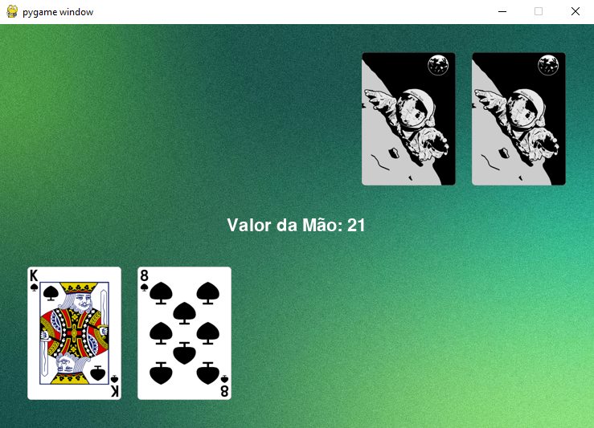

# Jogo de Blackjack (21) com Pygame

## Descrição

Este projeto é uma implementação simples de um jogo de Blackjack (21) utilizando a biblioteca Pygame com uma interface gráfica. No jogo, o jogador enfrenta um bot controlado pelo computador, com cartas exibidas na tela e controles básicos para interagir.

## Imagem do jogo


## Como Jogar

- O jogador começa com 2 cartas visíveis. Para pegar outra carta, pressione a tecla **espaço**.
- O objetivo é alcançar a maior pontuação possível somando os valores das cartas, sem ultrapassar 21.
- Para revelar a mão do bot e comparar com a sua própria mão, pressione a tecla **c**.
- Após analisar a situação, pressione **r** para iniciar uma nova rodada, embaralhando o baralho e distribuindo novas cartas.

## Funcionalidades Implementadas

- Interface gráfica com imagens de cartas.
- Distribuição de cartas para jogador e bot.
- Controles simples para pegar novas cartas, revelar mão do bot e reiniciar o jogo.

## Próximos Passos

- Melhorar a exibição das cartas do bot.
- Adicionar mais funcionalidades do jogo, como apostas e ações adicionais do jogador.

## Requisitos

- Python 3.7 ou superior
- Pygame 2.0.0 ou superior

## Instalação

1. Clone este repositório:
   ```sh
   git clone https://github.com/seu_usuario/jogo_blackjack.git
   ```
2. Navegue até o diretório do projeto:
   ```sh
   cd jogo_blackjack
   ```
3. Instale as dependências necessárias:
   ```sh
   pip install pygame
   ```